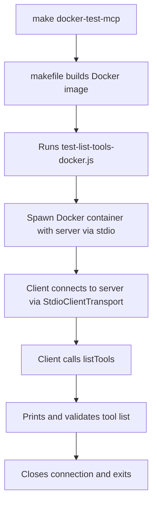

# Plan: Docker-Based Stdio Test for list-tools

## Phase 1: Analyze Makefile and Current Docker Implementation

**Task 1.1:** Examine how the makefile builds and runs Docker containers.
- Review the `docker-build` target that builds the image with tag "mcp-knowledge-graph"
- Analyze the `docker-test` and `docker-test-full` targets that use echo to pipe JSON-RPC commands
- Identify the limitations of the current approach for MCP compatibility

**Task 1.2:** Determine how to launch the server in Docker so that stdio is properly piped to the client.
- The client should spawn `docker run` as the command, with proper arguments to ensure stdio compatibility
- Identify the correct Docker options from the makefile (`-i`, `--rm`, etc.)

---

## Phase 2: Implement the Docker-based Test Script

**Task 2.1:** Create a new test file (`test-list-tools-docker.js`) based on `test-list-tools.js`.
- Change the transport command to run Docker, using the proper image name and options from the makefile:
  ```js
  const transport = new StdioClientTransport({
    command: "docker",
    args: [
      "run", "--rm", "-i", "--init",
      "mcp-knowledge-graph", // Docker image name from makefile
    ]
  });
  ```
- Ensure the transport args match the options used in the makefile

**Task 2.2:** Add documentation notes about requiring the Docker image.
- Include comments about running `make docker-build` before running the test
- Clearly document the dependency on the makefile's Docker build target

---

## Phase 3: Update Makefile with New Test Target

**Task 3.1:** Add a new makefile target to run the Docker-based test script.
- Create a `docker-test-mcp` target that runs the new test file
- Ensure it depends on the `docker-build` target to ensure the image is built

**Task 3.2:** Document the new makefile target and test script.
- Add comments explaining the difference between `docker-test` and `docker-test-mcp`
- Explain that the new approach is MCP compatible

---

## Phase 4: Document and Validate

**Task 4.1:** Add comprehensive documentation to the new test file.
- Explain purpose, usage, and requirements
- Document how it differs from the existing echo-pipe approach

**Task 4.2:** Validate the test by running it via the new makefile target.
- Confirm it successfully lists tools as expected
- Compare results with the existing `docker-test` approach

---

## Checklist

- [x] **Task 1.1:** Examine makefile Docker implementation
- [x] **Task 1.2:** Determine proper Docker stdio invocation for the server
- [x] **Task 2.1:** Implement the Docker-based test script with proper args
- [x] **Task 2.2:** Add documentation about makefile dependency
- [x] **Task 3.1:** Add new makefile target for Docker MCP test
- [x] **Task 3.2:** Document the new makefile target
- [x] **Task 4.1:** Add comprehensive documentation to test file
- [x] **Task 4.2:** Validate the test via CLI

---

## Success Criteria

- The new test script (`test-list-tools-docker.js`) runs the server in a Docker container via stdio and successfully lists tools
- The makefile includes a new target for running the MCP-compatible Docker test
- The approach properly uses the SDK's `StdioClientTransport` instead of echo-piping
- All checklist items are marked as complete after implementation and validation

---

## Mermaid Diagram

