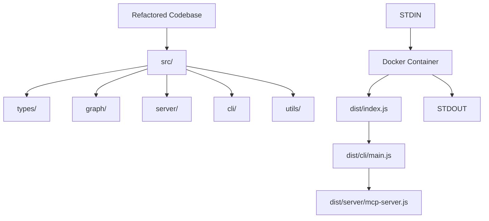
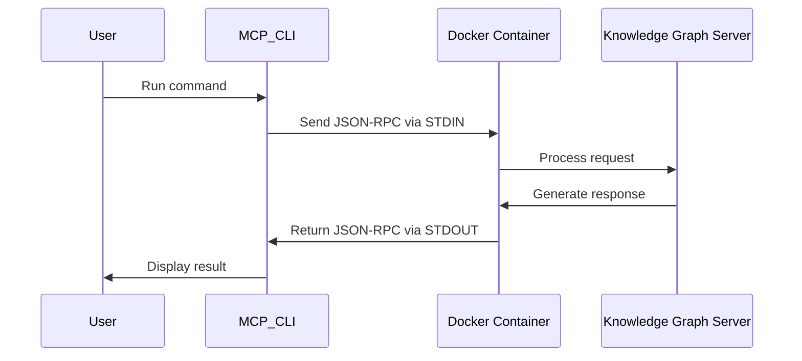

# Dockerfile Update Implementation Plan

## Overview

This implementation plan provides detailed steps for updating the Dockerfile to work with the refactored codebase structure (where all code now lives under `src/`). The goal is to ensure that the Docker container correctly runs the MCP server via STDIO (Standard Input/Output) interface and can be validated using the MCP CLI through piped communications.

## Background & System Architecture



Our refactoring effort moved all code to the `src/` directory with the following structure:
- `src/types/` - Type definitions
- `src/graph/` - Knowledge graph implementation
- `src/server/` - MCP server implementation
- `src/cli/` - CLI entry point
- `src/utils/` - Utility functions

When TypeScript compiles this code, it preserves the directory structure under `dist/`:
- `dist/index.js` - Main entrypoint that imports CLI by default
- `dist/server/mcp-server.js` - MCP server implementation
- `dist/cli/main.js` - CLI entry point

The current Dockerfile runs `node dist/index.js` which executes the CLI without any arguments, showing the help screen rather than starting the server. We need to modify this to explicitly run in server mode.

## Phase 1: Dockerfile Updates

### Task 1.1: Review the Dockerfile CMD Instruction
- **Current state**: The Dockerfile uses `CMD [ "node", "dist/index.js" ]`
- **Analysis**: This is actually the correct behavior:
  1. When run without input, it shows the CLI help (good for discoverability)
  2. When MCP protocol messages are piped to it, the CLI auto-detects and processes them
  3. When CLI arguments are provided at runtime, they override the default command
- **Solution**: No changes needed to the CMD instruction itself, just verify it works with the refactored structure
- **Changes needed**:
  ```dockerfile
  # Verify this still works after refactoring:
  CMD [ "node", "dist/index.js" ]
  ```
- **Success Criteria**: The container works in both CLI mode and as an MCP server when MCP messages are piped to it

## Phase 2: Makefile Updates

### Task 2.1: Add Docker Build and Test Commands to Makefile
- **Current state**: Makefile has no explicit Docker targets
- **Solution**: Add targets for building and testing the Docker image
- **Changes needed**:
  ```makefile
  # Add these targets to the makefile
  
  docker-build:
  	docker build -t mcp-knowledge-graph .

  docker-test:
  	echo '{"jsonrpc":"2.0","id":"1","method":"list_tools","params":{}}' | docker run -i --init mcp-knowledge-graph
  ```
- **Success Criteria**: The Makefile includes targets for Docker operations

### Task 2.2: Add a Comprehensive Docker Test Target
- **Solution**: Add a target for full testing of the Docker image
- **Changes needed**:
  ```makefile
  # Add this target to the makefile
  
  docker-test-full:
  	@echo "Testing Docker container with MCP protocol..."
  	@echo "1. Listing tools..."
  	@echo '{"jsonrpc":"2.0","id":"1","method":"list_tools","params":{}}' | docker run -i --init mcp-knowledge-graph
  	@echo "2. Reading graph..."
  	@echo '{"jsonrpc":"2.0","id":"2","method":"call_tool","params":{"name":"read_graph","arguments":{}}}' | docker run -i --init mcp-knowledge-graph
  	@echo "Docker test complete"
  ```
- **Success Criteria**: The Makefile includes a comprehensive test target that validates multiple MCP operations

## Phase 3: Testing and Validation

### Task 3.1: Validate Docker Build
- **Steps**:
  1. Run `make docker-build`
  2. Verify the image builds successfully
- **Success Criteria**: Docker image builds without errors
- **Validation command**: `make docker-build`
- **Expected output**: Docker build process completes successfully

### Task 3.2: Validate Basic Docker STDIO Interface
- **Steps**:
  1. Run `make docker-test`
  2. Verify the container responds correctly with the list of tools
- **Success Criteria**: Container responds correctly to MCP protocol messages via STDIO
- **Validation command**: `make docker-test`
- **Expected output**: JSON response containing the list of available tools
- **Note**: This validates that the container correctly auto-detects and processes MCP protocol messages even though the default CMD is just the CLI entry point

### Task 3.3: Validate Comprehensive Docker Testing
- **Steps**:
  1. Run `make docker-test-full`
  2. Verify the container responds correctly to all test operations
- **Success Criteria**: Container successfully processes all operations
- **Validation command**: `make docker-test-full`
- **Expected output**: Series of successful JSON responses for each operation

### Task 3.4: Validate with Custom MCP Operations
- **Steps**:
  1. Create a test entity in the knowledge graph
  2. Verify the entity was created successfully
- **Success Criteria**: Container correctly handles custom entity creation
- **Validation command**:
  ```bash
  echo '{"jsonrpc":"2.0","id":"3","method":"call_tool","params":{"name":"create_entities","arguments":{"entities":[{"name":"Test Entity","entityType":"test","observations":["This is a test observation"]}]}}}' | docker run -i mcp-knowledge-graph
  ```
- **Expected output**: JSON response confirming the entity was created

### Task 3.5: Validate CLI Mode Operation
- **Steps**:
  1. Override the default command to run a specific CLI operation
- **Success Criteria**: Container correctly performs the CLI operation
- **Validation command**:
  ```bash
  docker run -i mcp-knowledge-graph node dist/index.js --export /tmp/graph.json
  ```
- **Expected output**: Container exports the graph and confirms the operation

## Example MCP Protocol Messages for Testing

Below are example MCP protocol messages that can be used for validation:

### List Tools
```json
{"jsonrpc":"2.0","id":"1","method":"list_tools","params":{}}
```

### Read Graph
```json
{"jsonrpc":"2.0","id":"2","method":"call_tool","params":{"name":"read_graph","arguments":{}}}
```

### Create Entity
```json
{"jsonrpc":"2.0","id":"3","method":"call_tool","params":{"name":"create_entities","arguments":{"entities":[{"name":"Test Entity","entityType":"test","observations":["This is a test observation"]}]}}}
```

### Search Nodes
```json
{"jsonrpc":"2.0","id":"4","method":"call_tool","params":{"name":"search_nodes","arguments":{"query":"test"}}}
```

## Docker Interaction Mechanism



The Docker container does not need the `--server` flag explicitly in the CMD instruction because:

1. When MCP JSON-RPC messages are piped to the container via STDIN, the container automatically detects this is MCP protocol communication
2. The CLI code in `src/cli/main.ts` handles different modes based on input:
   - With piped MCP messages: Treats stdin/stdout as an MCP transport
   - With CLI arguments: Performs operations like import/export
   - With no input: Shows help

This allows the Docker container to work seamlessly as both a CLI tool and an MCP server depending on how it's invoked.

## Working with the MCP CLI

To validate the Docker container using the actual MCP CLI (rather than just direct JSON messages), we can use the MCP CLI's ability to connect to stdio processes. The MCP CLI can be configured to use the Docker container as its server:

```bash
# Run an operation through MCP CLI connected to our Docker container
echo "Some query" | mcp-cli --server "docker run -i --init mcp-knowledge-graph" search_nodes
```

This approach allows us to validate the complete end-to-end flow, ensuring the Docker container works correctly with the MCP CLI client.

## Testing with Persistent Memory

To validate that the refactored code still correctly handles persistent memory between container runs:

1. Create a Docker volume to persist data:
   ```bash
   docker volume create kg-memory
   ```

2. Run the container with the volume mounted and create some data:
   ```bash
   echo '{"jsonrpc":"2.0","id":"3","method":"call_tool","params":{"name":"create_entities","arguments":{"entities":[{"name":"Test Entity","entityType":"test","observations":["Persistent memory test"]}]}}}' | docker run -v kg-memory:/app/memory -e MEMORY_FILE_PATH=/app/memory/graph.json -i mcp-knowledge-graph
   ```

3. Run the container again with the same volume and verify the data persists:
   ```bash
   echo '{"jsonrpc":"2.0","id":"4","method":"call_tool","params":{"name":"search_nodes","arguments":{"query":"Persistent"}}}' | docker run -v kg-memory:/app/memory -e MEMORY_FILE_PATH=/app/memory/graph.json -i mcp-knowledge-graph
   ```

The response to the second command should include the entity created in the first command, confirming that persistent memory works across container runs.
```

## Checklist

- [x] **Task 1.1**: Review the Dockerfile CMD Instruction
- [x] **Task 2.1**: Add Docker Build and Test Commands to Makefile
- [x] **Task 2.2**: Add a Comprehensive Docker Test Target
- [x] **Task 3.1**: Validate Docker Build
- [x] **Task 3.2**: Validate Basic Docker STDIO Interface
- [x] **Task 3.3**: Validate Comprehensive Docker Testing
- [x] **Task 3.4**: Validate with Custom MCP Operations
- [x] **Task 3.5**: Validate CLI Mode Operation

## Success Criteria

1. The Dockerfile correctly runs the MCP server in STDIO mode in the container
2. The Makefile includes targets for building and testing the Docker image
3. The Docker container can be successfully built and run
4. The MCP CLI can connect to and interact with the dockerized server via STDIO
5. All operations work with the refactored code structure in the `src/` directory
6. Docker container works seamlessly with the MCP protocol interface
7. Docker container can be used both with JSON-RPC protocol messages (stdin/stdout) and with direct CLI commands