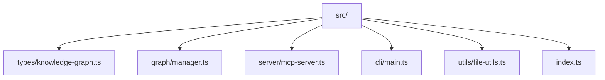

# Refactor Plan: Move Code to `src/` and Adopt Modern TypeScript Idioms

## Overview

This plan details the steps to refactor the codebase by moving all source code into a `src/` directory, modularizing the code, and adopting modern TypeScript idioms and best practices. The goal is to improve maintainability, clarity, and scalability.

---

## Phase 1: Prepare Project Structure

- **Task 1.1:** Create `src/` and subdirectories: `types/`, `graph/`, `server/`, `cli/`, `utils/`.  
  - *Success Criteria:* All required directories exist under `src/`.  
  - **Status:** ✅ Completed. All required directories are present.
- **Task 1.2:** Move and split code from `index.ts` into appropriate modules.
  - *Success Criteria:* No business logic remains in the project root; all code is in `src/`.

---

## Phase 2: Modularize Types and Business Logic

- **Task 2.1:** Move `Entity`, `Relation`, and `KnowledgeGraph` interfaces to `src/types/knowledge-graph.ts`.
  - *Success Criteria:* All type definitions are imported from a single location.
- **Task 2.2:** Move `KnowledgeGraphManager` to `src/graph/manager.ts`, importing types from above.
  - *Success Criteria:* Business logic is separated from entrypoints and types.

---

## Phase 3: Refactor Server and CLI Entrypoints

- **Task 3.1:** Move MCP server setup and tool registration to `src/server/mcp-server.ts`.
  - *Success Criteria:* Server logic is isolated and imports the manager and types.
- **Task 3.2:** Move CLI argument parsing and entrypoint logic to `src/cli/main.ts`.
  - *Success Criteria:* CLI logic is isolated and imports the manager and types.
- **Task 3.3:** Ensure CLI and server can be run independently.
  - *Success Criteria:* Both entrypoints work standalone.

---

## Phase 4: Update Imports and Exports

- **Task 4.1:** Update all imports/exports to use new paths and named exports.
  - *Success Criteria:* No broken imports; all modules use named exports.
- **Task 4.2:** Add `index.ts` files for module aggregation if needed.
  - *Success Criteria:* Directory-level imports are possible where appropriate.

---

## Phase 5: Update Build and Run Scripts

- **Task 5.1:** Update `tsconfig.json` to use `src/` as the root.
  - *Success Criteria:* TypeScript builds from the new structure.
- **Task 5.2:** Update `makefile` and `package.json` scripts to point to new entrypoints.
  - *Success Criteria:* All scripts work with the new layout.

---

## Phase 6: Testing and Validation

- **Task 6.1:** Ensure all functionality is preserved and tests (if any) pass.
  - *Success Criteria:* No regressions; all tests pass.
- **Task 6.2:** Add or update tests to cover refactored code.
  - *Success Criteria:* Refactored code is covered by tests.

---

## Proposed Directory Structure

---

## Checklist

- [x] **Task 1.1:** Create `src/` and subdirectories.
- [x] **Task 1.2:** Move and split code from `index.ts`.
- [x] **Task 2.1:** Move type definitions to `src/types/knowledge-graph.ts`.
- [x] **Task 2.2:** Move `KnowledgeGraphManager` to `src/graph/manager.ts`.
- [x] **Task 3.1:** Move MCP server setup to `src/server/mcp-server.ts`.
- [x] **Task 3.2:** Move CLI logic to `src/cli/main.ts`.
- [x] **Task 3.3:** Ensure CLI/server can run independently.
- [x] **Task 4.1:** Update all imports/exports.
- [x] **Task 4.2:** Add `index.ts` files for aggregation if needed.
- [x] **Task 5.1:** Update `tsconfig.json` for new structure.
- [x] **Task 5.2:** Update `makefile` and `package.json` scripts.
- [x] **Task 6.1:** Validate functionality and tests.
- [x] **Task 6.2:** Add/update tests as needed.

---

## Success Criteria

- All code is under `src/` with clear separation of concerns.
- Modern TypeScript idioms are used throughout.
- CLI and server entrypoints are modular and maintainable.
- All existing functionality is preserved and tested.